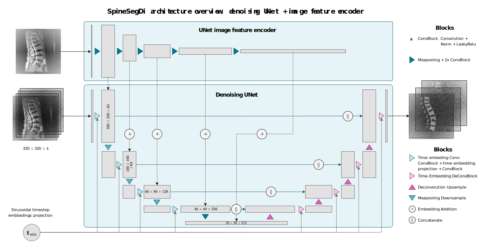
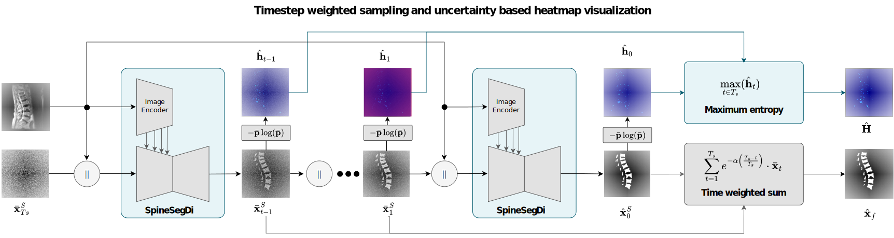
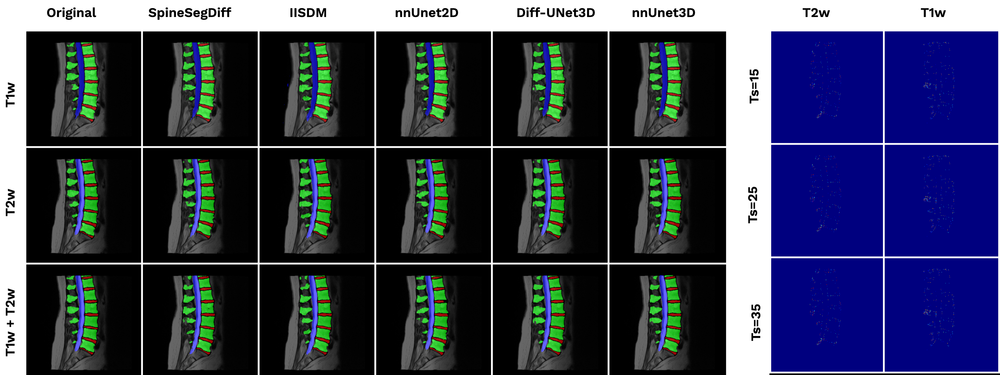

[user]: BMDS-ETH
[repo]: SpineSegDiff 

[issues-shield]: https://img.shields.io/github/issues/BMDS-ETH/SpineSegDiffnnUnet
[issues-url]: https://github.com/BMDS-ETH/SpineSegDiffnnUnet/issues

[](https://opensource.org/licenses/Apache-2.0)
[![Issues][issues-shield]][issues-url]
[](https://bmds-eth.github.io/SpineSegDiff/)


<div align="center">
<h1 align="center"> Diffusion Models for Lumbar Spine Segmentation</h1>

  <p align="center">
    <a href="https://bmds-eth.github.io/SpineSegDiff/">Project Info</a>
    ·
    <a href="https://gitlab.ethz.ch/BMDSlab/publications/low-back/diffusion-models-for-lumbar-spine-mri-segmentation/-/issues">Report Bug</a>
  </p>

   <p align="center">
     
     
   </p>
</div>


<a name="readme-top"></a>

## 📋 Project Overview

<!-- TABLE OF CONTENTS -->
<details>
  <summary>Table of Contents</summary>
  <ol>
    <li>
      <a href="#-project-overview">Project Overview</a>
    </li>
    <li>
      <a href="#installation">Installation</a>
    </li>
    <li>
      <a href="#how-to-train-the-model">How to Train the Model</a>
      <ul>
        <li><a href="#detailed-command-line-args">Command Line Arguments</a></li>
      </ul>
    </li>
    <li>
      <a href="#inference-spinesegdiff">Inference SpineSegDiff</a>
      <ul>
        <li><a href="#results">Results</a></li>
      </ul>
    </li>
    <li>
      <a href="#project-organization">Project Organization</a>
    </li>
    <li>
      <a href="#minimum-requirements">Minimum Requirements</a>
    </li>
    <li>
      <a href="#license">License</a>
    </li>
    <li>
      <a href="#acknowledgments">Acknowledgments</a>
    </li>
    <li>
      <a href="#contact">Contact</a>
    </li>
  </ol>
</details>
Welcome to an automated segmentation-tool for multi modal Magnetic Resonance Images. 
The goal is to generate multiclass segmentations of T1-weighted and T2-weighted scans.
The SPIDER Dataset is used for training the models.
The dataset should be organized as follows:

    /path/to/dataset/
      imagesTr/
          image_1.nii.gz
          image_2.nii.gz
          ...
      labelsTr/
          label_1.nii.gz
          label_2.nii.gz
          ...
      splits_final.json

<p align="right">(<a href="#readme-top">back to top</a>)</p>

## Installation

1. Clone the repository:
    ```sh
    git clone https://gitlab.ethz.ch/BMDSlab/publications/low-back/diffusion-models-for-lumbar-spine-mri-segmentation.git
    cd diffusion-models-for-lumbar-spine-mri-segmentation
    pip install -r requirements.txt
    ```


###  How to train the model


To train the SpineSegDiff model, run the following command:


```sh
python src/train.py --data_dir /path/to/data --logdir /path/to/logdir --num_classes 4 --timesteps 1000
```
The detailed command line args are:
```
-d, --data_dir str "./data/Dataset_SPIDER_T2w" # Dataset path
-l, --logdir str "./results/SpinsegDiff-T2w/fold_0" # Log directory
-b, --batch_size int 4 # Batch size
-e, --epochs int 1500 # Number of epochs
-c, --num_classes int 4 # Segmentation classes
-t, --timesteps int 1000 # Diffusion timesteps
-v, --val_every int 50 # Validation frequency
-vs, --val_start int 200 # Start validation at iteration
-f, --fold int 0 # Cross-validation fold
-p, --presegmentation bool False # Enable presegmentation
```

### Inference SpineSegDiff

To perform inference using a trained SpineSegDiff model, run:

```sh
F=0 # Fold number
TS=10 # Number of sampling timesteps
WEIGTHS_PATH="./models/LumbarSpineSegDiff/${DATASET}/fold-${F}"
RESULTS_PATH="./results/LumbarSpineSegDiff/S15-Ts${TS}/${DATASET}/fold-${F}"
python src/test.py -d "./data/${DATASET}" -c 4  --fold "${F}" -e 15 -ts ${TS} -w ${WEIGTHS_PATH} -sp "$RESULTS_PATH/outputs" 
```
The detailed command line args are: 
```
-d, --data_dir str "./data/SPIDER_T2w" # Dataset path
-w, --weights_dir str "./models/.../fold-0/" # Model weights
-sp, --save_path str "./results/.../visualization" # Output directory
Model Configuration
-dev, --device str "cuda:0" # Computing device
-c, --num_classes int 4 # Number of classes
-f, --fold int 0 # Cross-validation fold
Diffusion Parameters
-t, --timesteps int 1000 # Total timesteps
-ts, --timsteps_sample int 15 # Sampling timesteps
-e, --num_ensemble int 5 # Ensemble predictions
-p, --presegmentation flag False # Enable presegmentation
```

#### Results

The results of the inference will be saved in the specified `--save_path` directory, including:
- Output segmentation masks
- Uncertainty-based heatmaps
- Dice score CSV file
<div align="center">
   <p align="center">
     
   </p>
</div >

### Project Organization

------------
    ├── benchmark           <- The adapted code for benchmarking other approaches
    ├── data                  
    │   ├── raw             <- The original, immutable data dump.
    │   ├── processed       <- The final, canonical data sets for training in Medical Datathon format
    │       ├── SPIDER_T1w      <- SPIDER dataset for T1w images
    │       ├── SPIDER_T1wT2w   <- SPIDER dataset for T1w+ T2w images
    │       └── SPIDER_T2w      <- SPIDER dataset for T1w images
    ├── models              <- Trained and serialized models or model summaries
    │
    ├── docs                <- Documentaiton assets, manuals, and all other explanatory materials.
    │
    ├── results             <- Generated analysis as HTML, PDF, LaTeX, etc.
    │   ├── model           <- Generated graphics and figures to be used in reporting
    │       ├── outputs     <- The final, canonical data sets for training in D.
    │       └── mean_dice_semantic.csv           <- Relevant metrics after evaluating the model.
    │
    ├── src                <- Source code for use in this project.
    │   ├── __init__.py    <- Makes src a Python module
    │   │
    │   ├── dataset           <- Scripts to download or generate data
    │   │   ├── __init__.py
    │   │   └── SPIDER.py
    │   ├── networks         <- Modules of models architectures
    │   │   ├── SpineSegDiff.py
    │   │   └── denoising_UNet.py
    │   ├── results         <- Scripts to create results and oriented visualizations
    │   │   ├── ...         
    │   │   └── statistical_summary.py
    │   │
    │   └── training  <- Scripts to train models and related utils
    │       ├── ... 
    │       ├── trainer.py
    │       └── utils.py
    ├── LICENSE
    ├── README.md          <- The top-level README for developers using this project.
    └── requirements.txt   <- The requirements file for reproducing the analysis environment generated with `pip freeze > requirements.txt`

--------
<p align="right">(<a href="#readme-top">back to top</a>)</p>

### Minimum requirements

* Python 3.8+ 
* PyTorch 1.8+ 
* MONAI 
* OpenCV

<!-- LICENSE -->
## License

Distributed under the Apache License Version 2.0, License. See `LICENSE` for more information.

<p align="right">(<a href="#readme-top">back to top</a>)</p>


<!-- ACKNOWLEDGMENTS -->
## Acknowledgments

* [SPIDER Dataset](https://zenodo.org/records/10159290) We gratefully acknowledge the SPIDER dataset (DOI: 10.1038/s41597-024-03090-w) provided by Radboudumc, Jeroen Bosch Hospital, Rijnstate Hospital, and Sint Maartenskliniek.  This comprehensive multi-center lumbar spine MRI dataset with reference segmentations has been instrumental in training and validating our models.
* [MONAI Framework](https://monai.io) This project leverages the Medical Open Network for AI (MONAI), and  thank the MONAI community for their excellent tools and support.
* [DiffUNet](https://github.com/ge-xing/Diff-UNet)  Our implementation builds upon the DiffUNet architecture (https://arxiv.org/pdf/2303.10326). We thank the authors for making their codebase publicly available, which served as a foundation for developing our diffusion-based segmentation approach.


<!-- CONTACT -->
## Contact

Maria Monzon - PhD Student at ETH Zürich Biomedical Data Science Lab 
[Email Me](maria.monzon@hest.ethz.ch)  
[Github Profile](https://github.com/mariamonzon)

<p align="right">(<a href="#readme-top">back to top</a>)</p>


